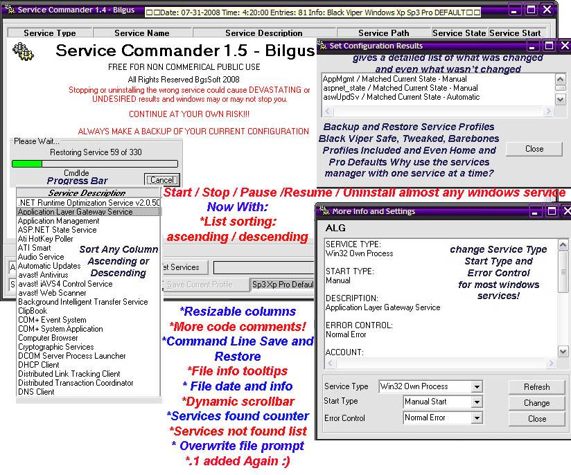



## Service Commander 1\.5

### Description

Why use the services manager and alter one service at a time when you can do them all with Service Commander?

Back Up / Restore Service Profiles Start/Stop/Pause/Resume/Uninstall almost any windows service

Change Service Type, Start Type, and Error Control for almost any windows service

Tired of getting event log errors because you stopped a service from starting, change the error control to make it not post an error

Includes Black Viper's Safe, Tweaked, and Barebone Service Profiles

(www.blackviper.com)

Even Includes Windows Xp Home and Pro Default Profiles so you can go back to a profile that works if you messed something up!

Now With:

Ascending/descending list sorting

More code comments

Resizable columns

File info tooltips

File date and info

Dynamic scrollbars when window is smaller than lists

Services found counter

Services not found list

Overwrite file prompt

Command line save and restore

Save and restore progress bar

.1 Added Again :)

New Features In 1.5!:

Color Keys:

Allow you to color item states in color of your choosing

Click Options Choose colors by selecting a color box then choose your color

Use Colored Text:

Checked = Text is colored in the selected colors

Unchecked = text is highlighted in the selected colors

Search Columns:

Right click on desired column choose 'Search This Column'

Type in desired search text for the next item choose the next button

Click 'Done' when finished

More descriptive error messages!

Change state box directly from menu without having to select state

Change settings without more info window

Numbers of Services Error, Changed, Not Changed, Not Found are now listed when restoring services

Comments and votes are appreciated!
 
### More Info
 
Read ReadMe.txt!

             |
---                |---
**Submitted On**   |2008-11-17 11:02:04
**By**             |[William W](https://github.com/Planet-Source-Code/PSCIndex/blob/master/ByAuthor/william-w.md)
**Level**          |Intermediate
**User Rating**    |5.0 (15 globes from 3 users)
**Compatibility**  |VB 6\.0
**Category**       |[Complete Applications](https://github.com/Planet-Source-Code/PSCIndex/blob/master/ByCategory/complete-applications__1-27.md)
**World**          |[Visual Basic](https://github.com/Planet-Source-Code/PSCIndex/blob/master/ByWorld/visual-basic.md)
**Archive File**   |[Service\_Co21344511172008\.zip](https://github.com/Planet-Source-Code/william-w-service-commander-1-5__1-70867/archive/master.zip)

